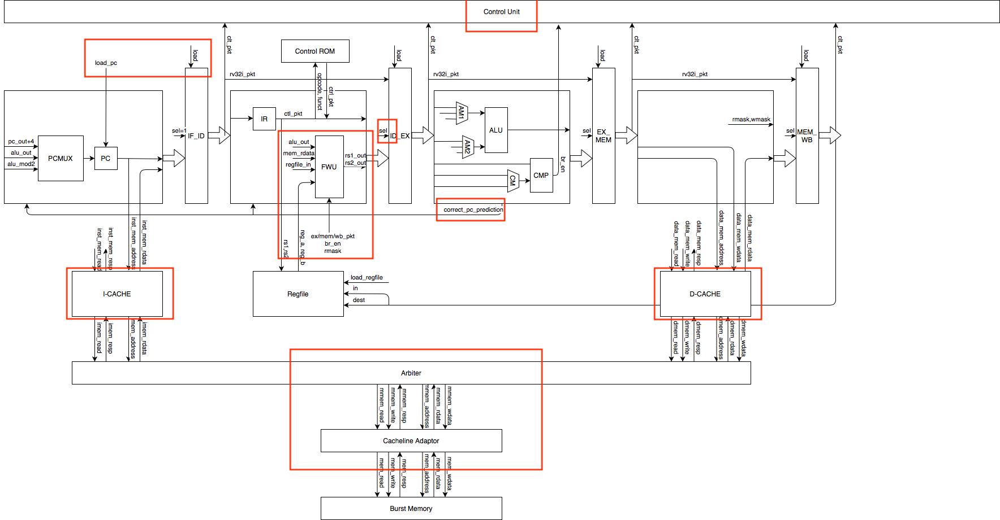

# Academic Integrity

If you are working on your own ECE 411 project, MAKE SURE you follow the academic integrity regulations and consult your instructors before referring to the code here. DO NOT copy the code without proper citation.

# Authors
Tingkai Liu (tingkai2@illinois.edu)
Zhi Cen (zhicen2@illinois.edu)

# Introduction

This repo contains a RISC-V 5-stage pipeline CPU (with some optimization) written in System Verilog, as the final project of UIUC ECE411 Fall 2020. It wins the 4th place in the final competition!

For detailed introduction, see https://github.com/TingkaiLiu/Pikachu_RISC-V_CPU/blob/master/doc/introduction.pdf

The source code locates at mp4/hdl/
